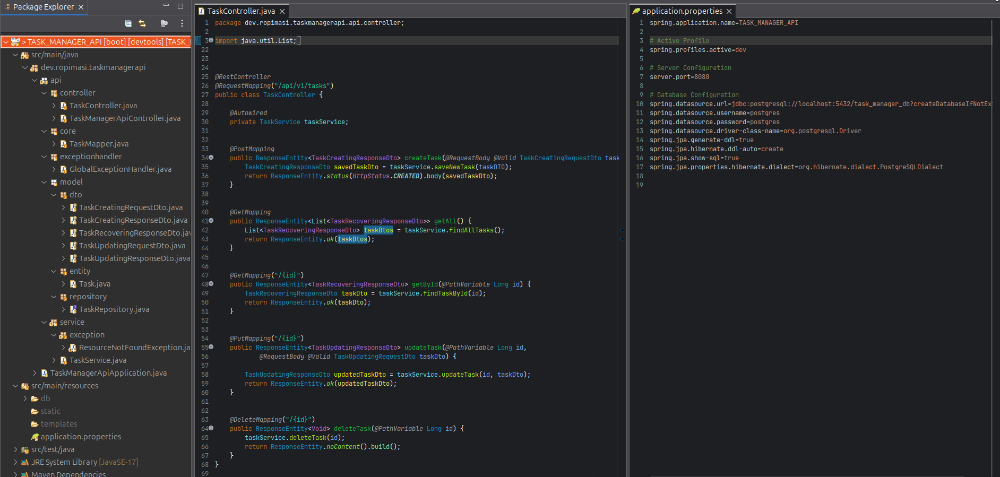

#  TASK MANAGER API
_(dev.ropimasi.taskmanagerapi)_  

&nbsp;  
&nbsp;  
&nbsp;  

## LIST OF CONTENTS
* [Attention: Rights, License and Disclaimer](#attention-rights)
* [Description](#description)
* [Description - Screenshots](#description-screenshots)
* [Techniques Used](#techniques)
* [Versioning Guideline](#versioning)
* [Features](#features)
* [Instructions](#instructions)
* [Author](#author)  

&nbsp;  
&nbsp;  
&nbsp;  

## ATTENTION: RIGHTS, LICENSE AND DISCLAIMER:
>**IMPORTANT NOTE / DISCLAIMER:** (en-US)
>This is a personal, private project, exclusively for the purposes of my studies in software development; This project and its resources are an integral, indivisible, inseparable part of a private project, which has its use expressly exclusive to its author, Ronaldo Silva (ropimasi@email.com / http://ropimasi.dithub.io); Any use, sale, rental, distribution, in part or in full of this project is prohibited; It is a project under development and experimentation, therefore I do not recognize or assume any responsibility for its use, nor for any possible reflections or consequences of such use.
>   
>**NOTA IMPORTANTE / ISENÇÃO DE RESPONSABILIDADE:** (pt-BR)
>Este é um projeto pessoal, privado, exclusivamente para fins dos meus estudos em desenvolvimento de software; Este projeto e seus recursos são parte integrante, indivisível, indissociável de um projeto privado, que tem seu uso expressamente exclusivo ao seu autor, Ronaldo Silva (ropimasi@email.com / http://ropimasi.github.io); É proibida qualquer utilização, venda, locação, distribuição, parcial ou integral deste projeto; É um projeto em desenvolvimento e experimentação, portanto não reconheço ou assumo qualquer responsabilidade pelo seu uso, nem por quaisquer possíveis reflexos ou consequências de tal uso.  

&nbsp;  
&nbsp;  
&nbsp;  

## DESCRIPTION
* SUBJECT: Java and Spring application for an API CRUD;
* PROJECT NAME: **TASK MANAGER API**;
* LIBRARY NAME: **---**;
* WHAT IS: **TASK MANAGER API** is a small software aims to provide an API _CRUD_ to tasks registry. More information about versions and compatibility can be found below;
* TO WIT: The **TASK MANAGER API** and its resources are a project sample, which I have developing to demonstrate some of my abilities. The **GRW** project belongs to my personal portfolio. Its detailed project can be followed just here on GitHub: [github.com/users/ROPIMASI/projects/](https://github.com/users/ROPIMASI/projects/). It is also found on my web-portfolio: [ropimasi.github.io](https://ropimasi.github.io/).  

&nbsp;  
&nbsp;  
&nbsp;  

### DESCRIPTION - SCREENSHOTS
##### CLI- Code & Build:  

&nbsp;  

##### Request & Response:  

&nbsp;  
&nbsp;  
&nbsp;  

## TECHNIQUES USED
// TO DO...  

&nbsp;  
&nbsp;  
&nbsp;  

## VERSIONING GUIDELINE
In a team project, it is very important to know and follow the specifications of the project version. Although at the moment this project's status is under early development (as it has not its first release version yet 1.0.0-release) however its project already is designed under [**_SemVer_** (Semantic Versioning Specification)](http://semver.org/).  
Thus, this project uses **_SemVer_** for its versioning. **_SemVer_** is a specification (set of rules) that tells us (or dictates) how to use the numbers (and some letters) on the _versioning-expression_ (_VerExpr_). More specifically, this project uses the following standardization: **_Major.Minor.Patch-ReleaseStatus+Build_**, where:
* The standard values of **_Major_**, **_Minor_**, and **_Patch_** for the _VerExpr_ are as follows:
  + Positive integer decimal numbers, without zero remaining on the left;
  + **_Major_** version represents wider changes in the project, which affects the main structure of the project, or its main objectives, or the last user API released;
  + **_Minor_** version represents smaller changes in the project, which don't affect above itens, but affect the amount of the application fuatrures with a new one or more, or remove an existing feature previouslly released;
  + **_Patch_** version represents specific changes which goals to fix or improve some feature, or undesired behavior in the application.  
* The standard flags of **_ReleaseStatus_** for the _VerExpr_ are as follows:
  + **_dev_**: in early development, usage not encouraged;
  + **_alpha_**: in development, first test phase, it's encouraged usage for **test only** by people involved with software development, at self-own risk;
  + **_beta_**: in pre-release version, general public usage is acceptable, however, **only for test**, usage is a choice at self-own risk;
  + **_release_**: release version; relatively stable in proportion to the effectiveness of the tests; bugs are possible to appear, so it would come back to a _hotfix-branch_ if needed.
* The standard values of **_Build_** for the _VerExpr_ are as follows:
  + A 12-digit numeric sequence, positive integer decimal digits, formatted somewhat to ISO 8601 DateTime YYYYMMDDhhmm;
  + The initial 4 digits (YYYY) represent the year;
  + The next 2 digits (MM) represent the month;
  + The next 2 digits (DD) represent the day;
  + The next 2 digits (hh) represent the hour;
  + The following 2 digits (mm) represent the minutes;
  + All of aboce referecing to the moment when the developer builds/exports the .JAR file (* 1).  
>  
> (* 1) The numerical sequence _Build_ necessarily/obligatorily refers to Greenwich Mean Time (GMT), also known as  Universal Time Coordinate (UTC), or "Z time" or "Zulu time".  
>  
> Example of **_Build_**: "202612311859".
>  
> Full example of **_Versioning-Expression_**: `1.2.3-release+202612311859`, meaning `1`._ ._ version fully implemented according to the project and its backlog; added by _ .`2`._ additional features to the main version, according to the project backlog and its issues priorities in the **_SCRUM life cycle_**; added by _ ._ .`3` patches fixed in this mentioned lastest version following the **_GITFLOW life cycle_**, that means, it is a released version after passed by the tests in **_alpha_** and **_beta_** pre-releases; and finally, it was specifically build at the year 2026 month 12 (December) day 31 at 18:59h at UTC/GMT/Z-time/Zulu-time (18hours and 59minutes equals 6p.m and 59minutes in some idioms).  

&nbsp;  
&nbsp;  
&nbsp;  

## FEATURES
### Features in current version (0.0.3)
  + A... //TODO:
  + B... //TODO:

&nbsp;  

### Features in target release version (1.0.0)
  + A... //TODO:
  + B... //TODO:

&nbsp;  
&nbsp;  
&nbsp;  

## INSTRUCTIONS
### Runnning
//TODO:  

&nbsp;  

### Usage
//TODO:

&nbsp;  
&nbsp;  
&nbsp;  

## Att. Ronaldo Silva.
##### | [https://ropimasi.github.io](https://ropimasi.github.io) | [linkedin @ropimasi](https://linkedin.com/in/ropimasi/) | [x (twitter) @ropimasi](https://x.com/ropimasi/) | [instagram @ropimasi](https://instagram.com/ropimasi/) | [ropimasi@email.com](mailto://ropimasi@email.com) |  

&nbsp;  
&nbsp;  
&nbsp;  
  