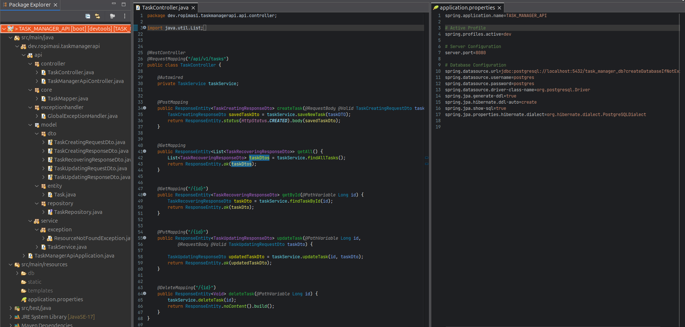
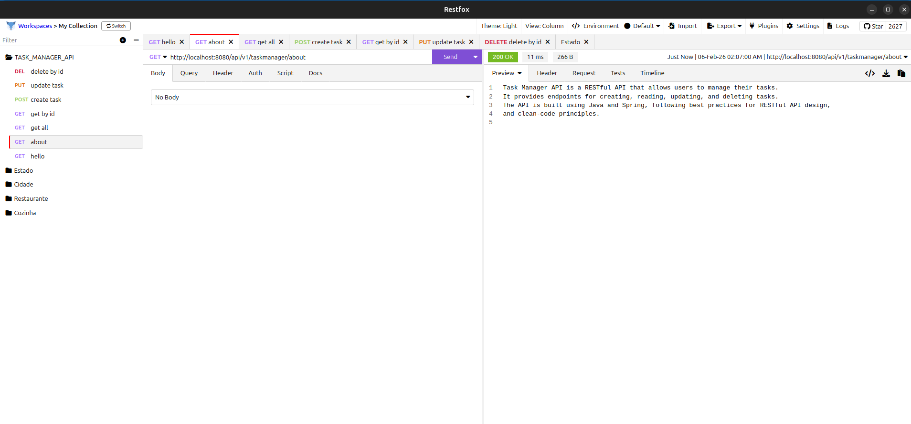
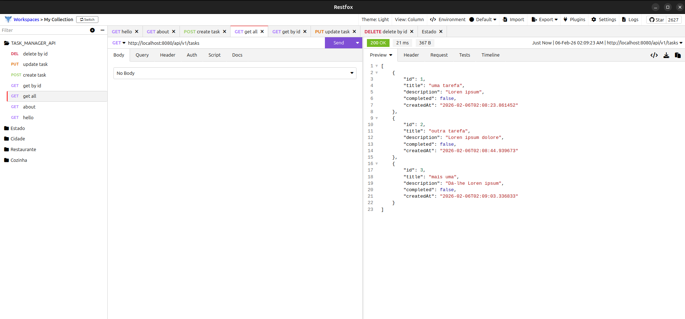
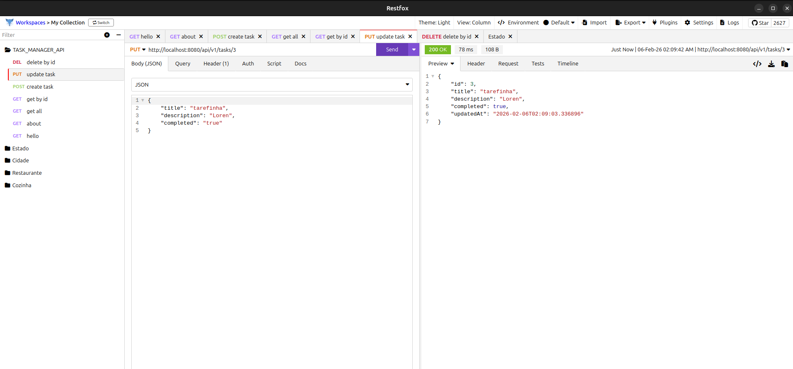

#  TASK MANAGER API
_(dev.ropimasi.taskmanagerapi)_  

&nbsp;  
&nbsp;  
&nbsp;  

## LIST OF CONTENTS
* [Attention: Rights, License and Disclaimer](#attention-rights)
* [Description](#description)
* [Description - Screenshots](#description-screenshots)
* [Techniques Used](#techniques)
* [Versioning Guideline](#versioning)
* [Features](#features)
* [Instructions](#instructions)
* [Author](#author)  

&nbsp;  
&nbsp;  
&nbsp;  

## ATTENTION: RIGHTS, LICENSE AND DISCLAIMER:
>**IMPORTANT NOTE / DISCLAIMER:** (en-US)
>This is a personal, private project, exclusively for the purposes of my studies in software development; This project and its resources are an integral, indivisible, inseparable part of a private project, which has its use expressly exclusive to its author, Ronaldo Silva (ropimasi@email.com / http://ropimasi.dithub.io); Any use, sale, rental, distribution, in part or in full of this project is prohibited; It is a project under development and experimentation, therefore I do not recognize or assume any responsibility for its use, nor for any possible reflections or consequences of such use.
>   
>**NOTA IMPORTANTE / ISENÇÃO DE RESPONSABILIDADE:** (pt-BR)
>Este é um projeto pessoal, privado, exclusivamente para fins dos meus estudos em desenvolvimento de software; Este projeto e seus recursos são parte integrante, indivisível, indissociável de um projeto privado, que tem seu uso expressamente exclusivo ao seu autor, Ronaldo Silva (ropimasi@email.com / http://ropimasi.github.io); É proibida qualquer utilização, venda, locação, distribuição, parcial ou integral deste projeto; É um projeto em desenvolvimento e experimentação, portanto não reconheço ou assumo qualquer responsabilidade pelo seu uso, nem por quaisquer possíveis reflexos ou consequências de tal uso.  

&nbsp;  
&nbsp;  
&nbsp;  

## DESCRIPTION
* SUBJECT: Java and Spring application for an API CRUD;
* PROJECT NAME: **TASK MANAGER API**;
* WHAT IS: **TASK MANAGER API** is a small software aims to provide an API _CRUD_ to tasks registry. More information about versions and compatibility can be found below;
* TECH-STACK:
  + Java 17
  + Spring Boot 3
  + Spring Data JPA
  + Lombok
  + Hibernate Validator
  + PostgreSQL v16

&nbsp;  
&nbsp;  
&nbsp;  

### DESCRIPTION - SCREENSHOTS
##### Code & Build:  

&nbsp;  

##### Request & Response:  

&nbsp;  
&nbsp;  
&nbsp;  

## TECHNIQUES USED
  + Layered Architecture: Clear separation between Controller, Service, Repository, and DTOs;
  + Data Mapping: Use of a dedicated Mappers layer to isolate JPA Entities from API Contracts (DTOs);
  + Immutability with Java Records: Use of Records for data representation, ensuring concise and immutable DTOs;
  + Global Error Handling: Centralization of exceptions with @ControllerAdvice, returning standardized errors and semantic HTTP codes;
  + Automatic Auditing: Automated registering of creation date (createdAt) and update date (updatedAt) managed by Hibernate;
  + Data Validation: Use of Bean Validation to ensure the integrity of received information (e.g., @NotBlank, @Size);
  + Robust Persistence: Integration with Spring Data JPA for efficient operations on relational databases.  

&nbsp;  
&nbsp;  
&nbsp;  

## VERSIONING GUIDELINE
In a team project, it is very important to know and follow the specifications of the project version. This project is designed under [**_SemVer_** (Semantic Versioning Specification)](http://semver.org/).  
Thus, this project uses **_SemVer_** for its versioning. **_SemVer_** is a specification (set of rules) that tells us (or dictates) how to use the numbers (and some letters) on the _versioning-expression_ (_VerExpr_).  

See more details about the versioning for this project in [readme-pages/versioning.md](readme-pages/versioning.md).

&nbsp;  
&nbsp;  
&nbsp;  

## FEATURES
### Features in current version (0.6.0)
  + Task creation: Endpoint to registry new tasks with required fields validation;
  + General listing: Recovering all tasks registered and converted to a _DTO_ list;
  + Search by `Id`: Detailed seeking a specific task id;
  + Fully update (_PUT_): Edit an existent task replacing all fields;
  + Partial update (_PATCH_): Edit an existent task replacing only some fields sent in the request's body;
  + Hard delete: Exclusion of records on databse by `Id`.
  + Search by `complete` field: Detailed seeking of a list of tasks with `complete` field marked as complete;
  + Search by `complete` field: Detailed seeking of a list of tasks with `complete` field marked as not complete;
  + Search by `title` field: Detailed seeking of a list of tasks with `title` field containing a string sent by API's client;
  + Centralized exception handling: Standardized API error responses for better client-side integration;
  + Unit Testing: Implementation of comprehensive unit tests using JUnit and Mockito;

&nbsp;  

### Features in target release version (1.0.0)
  + All features above, and plus...
  + API Documentation: Integration with OpenAPI/Swagger for interactive documentation;
  + Multi-user Support: Introduction of the `User` entity and task-to-user bounding;
  + Security: Implementation of Authentication and Authorization to restrict task access to owners only.  
  
&nbsp;  
&nbsp;  
&nbsp;  

## INSTRUCTIONS
### Runnning
//TODO:  

&nbsp;  

### Usage
//TODO:

&nbsp;  
&nbsp;  
&nbsp;  

## Att. Ronaldo Silva.
##### | [https://ropimasi.github.io](https://ropimasi.github.io) | [linkedin @ropimasi](https://linkedin.com/in/ropimasi/) | [x (twitter) @ropimasi](https://x.com/ropimasi/) | [instagram @ropimasi](https://instagram.com/ropimasi/) | [ropimasi@email.com](mailto://ropimasi@email.com) |  

&nbsp;  
&nbsp;  
&nbsp;  
  